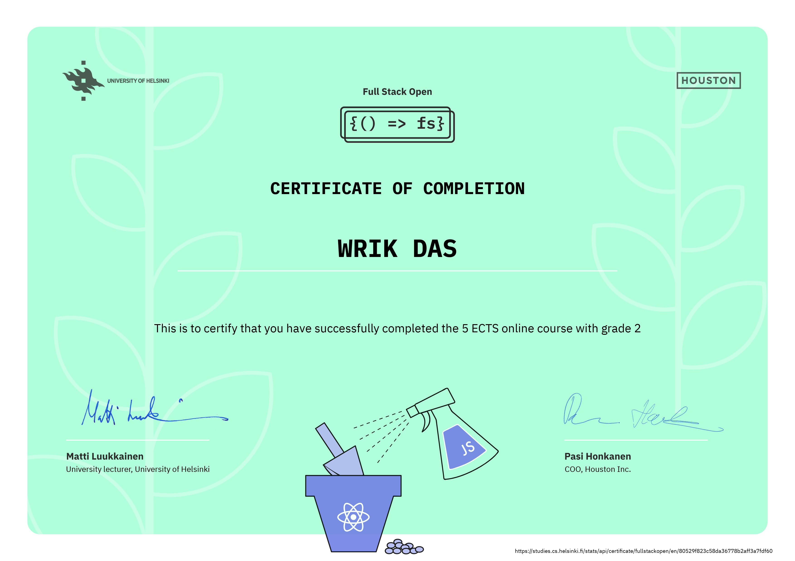

# Full Stack Open

## What is it?

[Full Stack Open](https://fullstackopen.com/en/) is an online MOOC organized by the University of Helsinki with the aim of teaching modern full stack web development to programmers. The main focus is on building single page web applications with ReactJS that use REST APIs built with Node.js.

## Certificate of completion!

## What does this repo contain?

This repo contains my submissions to the exercises on full stack open. Currently it holds all of the exercise solutions (including optional exercises) till part 5 of the course.
